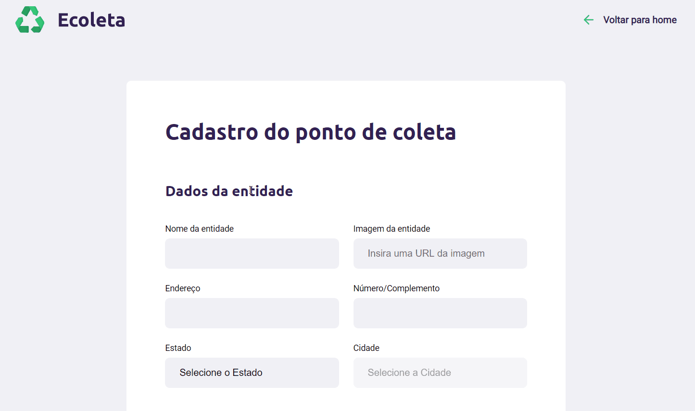

<h1 align="center">
 
  
 
 
Ecoleta
</h1>

O Ecoleta é uma aplicação para cadastro de pontos de coleta de resíduos eletrônicos.

  
   
  

## 🚀 Technologies

This project was developed with the following technologies:

- ✔️ HTML

- ✔️ CSS

- ✔️ Javascript

- ✔️ NodeJS

- ✔️ Nunjucks

- ✔️ SQLite 3

Made with ♥ by Thiago dos Santos :wave: [Get in touch!](https://www.linkedin.com/in/tdsantos1981/)